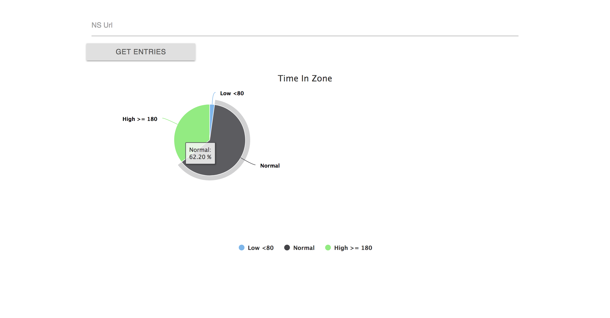

# Nightscout-TimeInZone

<table>
<tr>
<td>
  React App giving the user their time each zone. There are three Zones, Low (< 80), Normal (80-179), High (>= 180).
  User provides Nightscout URL to retrieve their entries to be calculated time in zones to display on pie chart.
</td>
</tr>
</table>

## Demo

Here is a working live demo : https://ns-time-in-zone.herokuapp.com/

## Site

### Desktop

